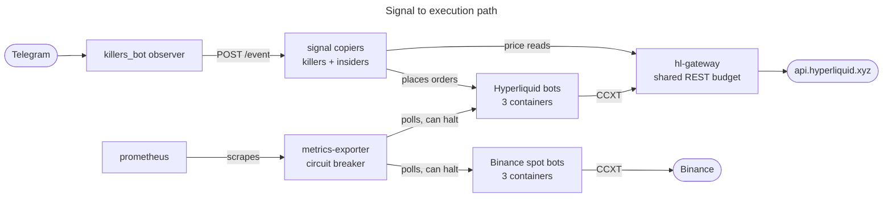

# Master Trader — Multi-Bot Algorithmic Trading System

A multi-strategy crypto trading system built on [Freqtrade](https://www.freqtrade.io/). The September 11 production review found three live bots and three dry-run bots, with health monitoring and consolidated portfolio analytics. Current revisions are still collecting evidence; reachability alone does not establish execution readiness or profitability.

Current production fleet:

| Venue | Bots | Observed mode |
|---|---|---|
| Binance spot | FundingFadeV1, KeltnerBounceV1 | Live; shared wallet |
| Hyperliquid futures | KillersScalpV1 | Live; native stop-limit orders verified |
| Binance spot | OITrendPullbackV1 | Dry-run |
| Hyperliquid futures | InsidersScalpV2, ShortKeltnerV2HLlive | Dry-run |

The [September 11 paper and fleet review](docs/audits/2026-09-11-order-flow-and-fleet-review.md)
records execution faults, local remediation, unresolved accounting issues,
and the proposed order-flow research protocol. Consult runtime configuration
for current modes; local fixes described in that review are not yet deployed.

The current authorization, known limitations, remediation status, and next
review are recorded in
[the 2026-08-24 live-fleet audit](docs/audits/2026-08-24-live-fleet-review-remediation.md).

## Architecture

Production stack, `ft_userdata/docker-compose.prod.yml`, 13 services:



Arrows show request initiation, not data flow. `metrics-exporter` and `prometheus` both poll, so on
those edges the data travels the other way.

The diagram covers the signal-to-execution path only. Left out for legibility: `funding-refresh`,
which writes Binance funding rates into the shared `ft_user_data` volume that all six bots and the
dashboard mount; `ft-dashboard`, which reads four read-only state volumes rather than Prometheus; and
per-service ports. `ft_userdata/docker-compose.prod.yml` holds all 13 services, and every published
port binds to `127.0.0.1`.

`metrics-exporter` takes its bot list from `ft_userdata/bots_config.json`
(`ft_userdata/metrics_exporter.py:36`), polls each bot's Freqtrade REST API on `:8080` (`:271`,
`:477`), and halts entries when the portfolio circuit breaker trips by posting `/stopentry` (`:485`).
That config file is the source of truth for which strategies are active and which wallet each one
draws on, so check it rather than this diagram if the two ever disagree.

`killers_bot` is not in this stack. It runs from `killers_bot/docker-compose.yml` and reaches the
receivers over HTTP.

What runs on a schedule, and from where, is in [Automation Scripts](#automation-scripts) below.

## Quick Start

The maintainer runs this on a VPS; see [RUNTIME.md](RUNTIME.md). The steps below stand up your own
instance from a fresh clone.

### Prerequisites

- Python 3.13, which is what the suites are tested against
- Docker and Docker Compose, for the stack
- A Binance spot account and/or a Hyperliquid account. Keys are optional for dry-run.

### 1. Clone and run the tests

```bash
git clone https://github.com/IvPalmer/Master-Trader.git
cd Master-Trader
python3 -m venv .venv
.venv/bin/pip install -r requirements-dev.txt
```

```bash
V=$PWD/.venv/bin/python
$V -m pytest tests/ -q
(cd services/killers-receiver  && $V -m pytest tests/ -q)
(cd services/insiders-receiver && $V -m pytest tests/ -q)
(cd ft_userdata/ft_dashboard   && $V -m pytest tests/ -q)
(cd services/hl-gateway        && $V -m pytest tests/ -q)
(cd services/trade-webhook     && $V -m pytest tests/ -q)
$V -m pytest killers_bot/tests/ -q
```

These are the Python suites CI runs on every pull request, in the same order
(`.github/workflows/tests.yml`; `tests/test_readme_matches_fleet.py` fails if the two drift apart).
No Docker is needed; the read-only VPS checks in `tests/test_infrastructure.py` are opt-in behind `MT_VPS_INTEGRATION=1`. `freqtrade` is not required
either, and the two funding-staleness tests skip without it.

### 2. Where things live

Nothing needs copying. `ft_userdata/` is both the Freqtrade working directory and the Compose build
context:

- `ft_userdata/user_data/strategies/` strategy files
- `ft_userdata/user_data/configs/` per-strategy configs
- `ft_userdata/user_data/config-backtest.json` backtesting config
- `ft_userdata/bots_config.json` which strategies are active, and their wallets
- `ft_userdata/prometheus.yml`, `ft_userdata/exporter/`, `ft_userdata/Dockerfile.nfi` monitoring and
  image build inputs
- `deploy/` holds only `vps/`, operational scripts for the maintainer's host

Earlier revisions of this README copied files out of a top-level `deploy/` tree. That tree was
consolidated into `ft_userdata/` in `c1885d7` and no longer exists.

### 3. Configure a bot

Start from an existing config in `ft_userdata/user_data/configs/`, then set:

- `api_server.jwt_secret_key` and `api_server.password`
- `exchange.key` and `exchange.secret` for live trading, left empty for dry-run
- `dry_run_wallet` and `max_open_trades`

### 4. Running the stack

Steps 1 to 3 are the whole contributor setup. The suites are network-free and need no containers, so
nothing above requires Docker.

Running the bots is a different thing, and `ft_userdata/docker-compose.prod.yml` is the maintainer's
deployment rather than a fresh-clone target. It expects four things this repository does not
provision:

- 36 operator environment variables, among them `FREQTRADE__EXCHANGE__KEY` and a user and password
  per bot API
- the external network `dokploy-network` (`:565`)
- the external volume `claude-assistant_claude_auth` (`:574`)
- host paths under `/home/ubuntu/` (`:535`, `:542`)

`FREQTRADE__`-prefixed variables override the JSON, so a credential edited in step 3 is not
necessarily the one a container runs with.

The dev `ft_userdata/docker-compose.yml` is a five-service subset, three bots plus `metrics-exporter`
and `prometheus`, with no external network or volume. It still needs exchange credentials and no test
exercises it.

[RUNTIME.md](RUNTIME.md) is the deployment path, and it is VPS-only by policy. Once a stack is up,
this checks the bots answer:

```bash
for port in 8095 8096 8102; do
  echo -n "port $port: "
  curl -s -u <api_user>:<api_password> http://127.0.0.1:$port/api/v1/ping
  echo
done
```

### 5. Scheduled jobs

There is no installer. The VPS's host cron lines are listed in
[deploy/vps/README.md](deploy/vps/README.md) and in the table below; the rest of the schedule lives
in containers. `ft_userdata/automation_scheduler.sh` is the retired pre-VPS installer and refuses to
run (#100). The health report can be run by hand:

```bash
python3 ft_userdata/strategy_health_report.py --stdout
```

## Automation Scripts

What the VPS runs, checked against its crontab, systemd timers and compose file on 2026-10-02:

| Job | How it runs | Schedule | Output |
|-----|-------------|----------|--------|
| `strategy_health_report.py` | host cron, `deploy/vps/run-health-report.sh` | Daily 23:00 UTC | Telegram via trade-webhook |
| Killers open-risk monitor, `services/killers-receiver/warden/risk_warden.py` | host cron, `docker exec killers-receiver` | Every 5 min | Telegram alert when findings change; alerts only |
| `metrics_exporter.py` | `metrics-exporter` container | Every 60 s | Prometheus metrics + portfolio circuit breaker |
| `download_funding_rates.py --incremental` | `funding-refresh` container | Hourly at :10 | Funding feathers in `ft_user_data` |
| Profit-retention collectors, `research/profit_retention/` | systemd timers | Every 1 and 5 min | Read-only research observations |

Not scheduled anywhere, run by hand: `backtest_engine.py` (the six-stage validation pipeline),
`backtest_gate.py`, `hyperopt_optimizer.py`, `walk_forward.py`, `tournament_manager.py`,
`bot_rotator.py`, `bot_evolution_tracker.py` and `ai_health_report.py`. No scheduled backup of the
live databases is installed (#99).

All scripts can be run manually: `python3 script.py --help`

## Risk Management

What is in force for the deployed fleet, and where each control lives. The numbers are left to the
code they come from, because tuning PRs change them.

1. **Per-trade stop**: each strategy file sets `stoploss` (`ft_userdata/user_data/strategies/`), and
   no deployed config overrides it. Live bots place the stop on the exchange as a stop-limit
   (`order_types.stoploss_on_exchange` in their configs). The dry-run Hyperliquid bots switch that
   off in their compose entrypoint. Trailing stops are on only in `KeltnerBounceV1` and
   `OITrendPullbackV1`. `KillersScalpV1`, which both copier bots run, moves its stop to the signal's
   posted stop through `custom_stoploss`; its own `stoploss` is only the floor until then.
2. **Per-bot protections**: `CooldownPeriod` and `StoplossGuard` in `KeltnerBounceV1`,
   `FundingFadeV1` and `OITrendPullbackV1`. `ShortKeltnerV2HL` adds `MaxDrawdown`. `KillersScalpV1`
   defines none: its entries are admitted by the receivers (layer 7). No strategy uses
   `LowProfitPairs`.
3. **Time-based exits** (`custom_exit`): `KeltnerBounceV1` closes a trade still losing after 120h.
   `FundingFadeV1` closes one still losing after 96h, or under +1% after 168h. `ShortKeltnerV2HL`
   closes a short after 36h. `OITrendPullbackV1`'s `custom_exit` exits on a close below EMA50, not on
   a timer. Copier exits come from the receivers.
4. **Anti-correlation**: not in force. No deployed config uses `OffsetFilter`; the only one that
   does is `BollingerRSIMeanReversion.json`, which is not deployed. `FundingFadeV1` and
   `KeltnerBounceV1` trade overlapping `StaticPairList` whitelists from the same `binance-spot`
   wallet, so their exposure is correlated rather than split.
5. **Portfolio circuit breaker** (`ft_userdata/metrics_exporter.py`): when live account equity,
   adjusted for the deposits and withdrawals recorded in `ft_userdata/account_transfers.json`, falls
   10% below its peak, it sends `/stopentry` to every live bot and a Telegram alert. That halts new
   entries only; open positions and their exits keep running. It evaluates only when every live
   account can be valued (#104).
6. **Automated pause**: not in force for the deployed fleet. `tournament_manager.py` has a
   score-below-30 rule, but nothing schedules it, its hardcoded bot list names only retired
   strategies, and its "pause" sets allocation to zero without stopping a container.
   `bot_rotator.py` reads `bots_config.json` and does `docker stop` after two consecutive flagged
   evaluations, but nothing schedules it either. See #31.
7. **Copier admission and open-risk monitor** (`services/killers-receiver`, settings in
   `ft_userdata/docker-compose.prod.yml`): each receiver sizes an entry from the signal's posted stop
   (`KILLERS_RISK_USD`, with margin and leverage caps) and refuses a signal without one
   (`KILLERS_REQUIRE_POSTED_SL`). It admits at most `KILLERS_MAX_OPEN` positions, counting resting
   entries, and force-exits a position once the mark crosses its posted stop (`KILLERS_POSTED_SL`).
   The Killers open-risk monitor (`warden/risk_warden.py`, every 5 minutes) checks the open book
   against that sizing contract. It only alerts and has no write path to Freqtrade.

`research/risk-implementation-plan.md` is the original 2026-03 plan, kept as a historical record.

## Monitoring

Dashboard product rules and the design system live in [PRODUCT.md](PRODUCT.md) and
[DESIGN.md](DESIGN.md); changes to the dashboard must stay consistent with them.

- **ft-dashboard**: the operator dashboard (`ft_userdata/ft_dashboard/`, FastAPI), portfolio summary
  and per-bot analytics. Served behind Traefik in production rather than on a published port.
- **FreqUI**: `http://127.0.0.1:<port>` per bot, the native Freqtrade web UI. Ports are listed under
  Architecture.
- **Prometheus**: `http://127.0.0.1:9091`, raw metrics.

## External Integrations (Optional)

### Telegram Notifications

The system sends reports via HTTP webhook. If you have a Telegram bot:
1. Set `WEBHOOK_URL` in each automation script to your bot's webhook endpoint
2. The webhook receives `POST` with `{"type": "status", "status": "message text"}`
3. Or set `telegram.enabled: true` in strategy configs for native Freqtrade Telegram

### Claude Assistant (Palmer's Setup)

Palmer uses a custom Telegram bot (`claude-assistant`) that:
- Receives webhooks from Freqtrade and forwards formatted trade notifications
- Runs scheduled jobs (morning/evening status, daily health report) via APScheduler
- Source: separate repo, not required for the trading system to work

To replicate: set up any webhook receiver that accepts the payload format above, or just enable Freqtrade's native Telegram integration.

## Repository Structure

Current operator-dashboard behavior, consolidated portfolio semantics, chart lifecycle safeguards, and the dashboard-only deployment procedure are documented in [docs/dashboard-portfolio-analytics-2026-08-23.md](docs/dashboard-portfolio-analytics-2026-08-23.md).

```
ft_userdata/                     # Freqtrade working dir and Compose context
  docker-compose.prod.yml        # production stack, 13 services
  docker-compose.yml             # dev stack
  bots_config.json               # which strategies are active, and their wallets
  prometheus.yml                 # Prometheus scrape config
  Dockerfile.nfi                 # bot image build
  exporter/                      # metrics exporter image
  ft_dashboard/                  # FastAPI operator dashboard
  engine/                        # validation engine
  user_data/
    strategies/                  # strategy files
    configs/                     # per-strategy configs
    config-backtest.json         # backtesting config
  strategy_health_report.py      # daily health scoring
  backtest_gate.py               # backtesting validation gate
  hyperopt_optimizer.py          # parameter optimization
  tournament_manager.py          # capital rebalancing
  walk_forward.py                # walk-forward validation
  metrics_exporter.py            # Prometheus metrics + circuit breaker
  bot_evolution_tracker.py       # snapshots
  automation_scheduler.sh        # retired pre-VPS cron installer; refuses to run

services/
  killers-receiver/              # Telegram signal copier
  insiders-receiver/
  hl-gateway/                    # shared Hyperliquid REST proxy
  trade-webhook/

research/                        # strategy research and evidence
  REPORT.md                      # synthesized findings
  risk-implementation-plan.md    # risk management plan
  automation-system.md           # automation layer documentation

docs/                            # audits, runbooks, session records
deploy/vps/                      # VPS operational scripts
killers_bot/                     # Telegram listener
tests/                           # root test suite
```

## Key Principles

1. **Be obsessive about not losing money** — prefer missing a trade over taking a bad one
2. **No arbitrary numbers** — every parameter backed by evidence (MAE analysis, backtests)
3. **Portfolio-level protection** — not just per-bot
4. **No auto-deploy of optimizations** — human approval required
5. **Out-of-sample validation** — never trust in-sample results alone
